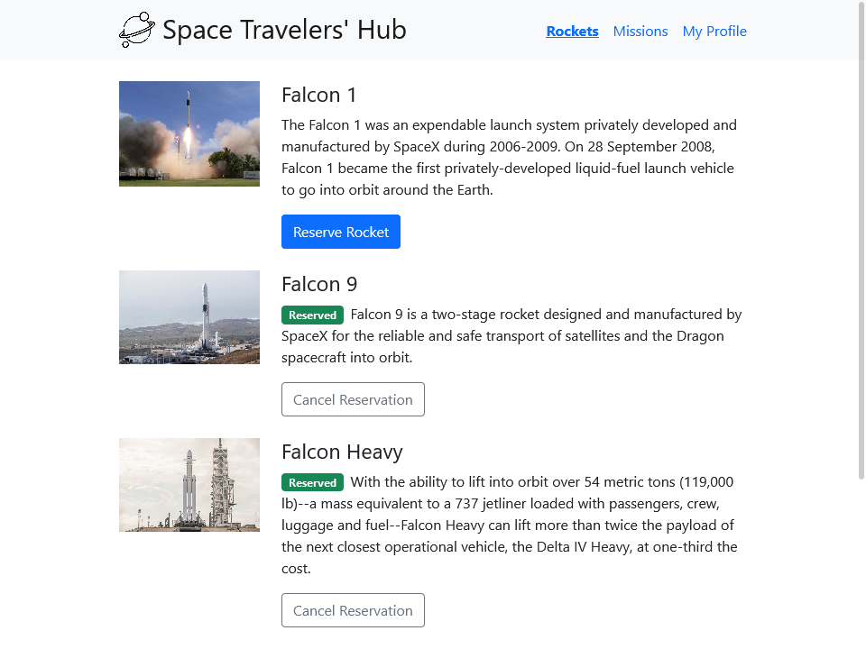
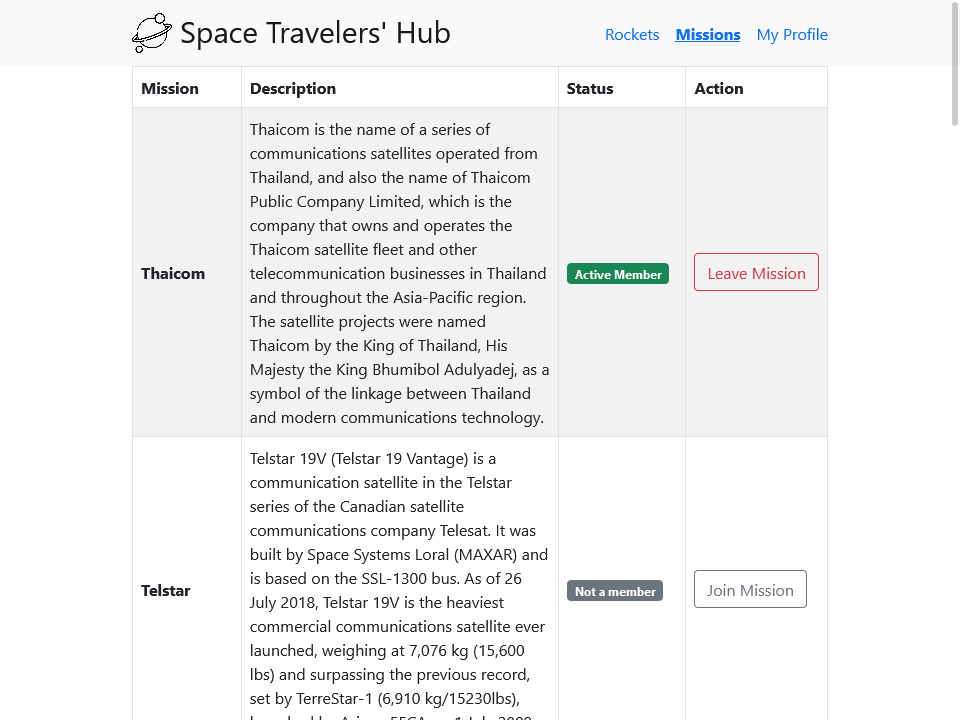
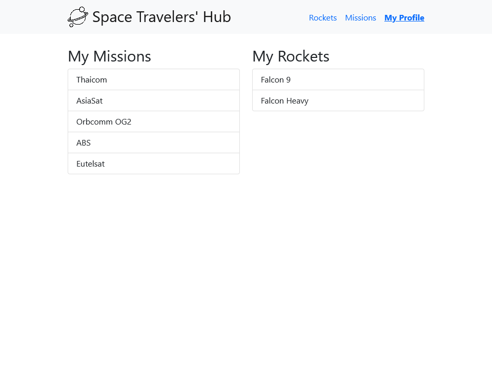

# Space Travelers' Hub

> Showcase SpaceX rockets and missions.





A React and Redux app consuming data from the SpaceX API.

## Built With

- HTML & CSS
- JavaScript
- React
- Redux

## Live Demo

Check out a live demo of this project by [clicking here.](https://space-travelers-x.netlify.app/)

## Getting Started

To get a local copy up and running follow these steps.


### Prerequisites

- [npm](https://docs.npmjs.com/downloading-and-installing-node-js-and-npm)

### Setup

1. Download or clone the repository's contents.
2. Go to the project's root directory.
```
cd space-travelers-hub
```
3. Install all the dependencies:
```
npm install
```

### Install

You can either build a local production version of the project or open it directly on a server in development mode.

  #### Build

  1. To build and open a production version of the app run the command:
  ```
  npm run build
  ```
  2. Then open *dist/index.html* in you preferred browser.

  #### Start Development Server

  1. To open the app in development mode on *dev-server* run:
  ```
  npm start
  ```
  2. Then go to `http://localhost:3000/` in you preferred browser.

## Author

👨‍💻 **Breno Xavier**

- GitHub: [@brenoxav](https://github.com/brenoxav)
- Twitter: [@brenoxav](https://twitter.com/brenoxav)
- LinkedIn: [Breno Xavier](https://linkedin.com/in/brenoxav)

👩‍💻 **Ijay Abby**
- GitHub: [@IjayAbby](https://github.com/IjayAbby)
- Twitter: [@Ijay_js](https://twitter.com/Ijay_js)
- LinkedIn: [Abigael Nyangasi](https://www.linkedin.com/in/ijayabby4/)

## 🤝 Contributing

Contributions, issues, and feature requests are welcome!

Feel free to check the [issues page](https://github.com/brenoxav/space-travelers-hub/issues).

## Show your support

Give a ⭐️ if you like this project!

## Acknowledgments

- Microverse
